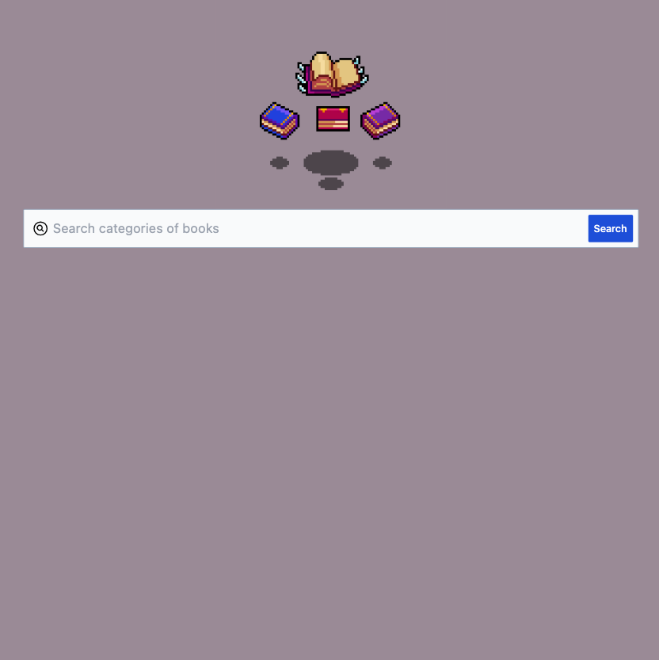

# Web Library

> Cant't find the book to read? This is for you!

    

## Key Feature

<ol>
  <li><strong>Intuitive Search:</strong> Input your desired category, such as "Fantasy," "Mystery," "Historical Fiction," and more.</li>
  <li><strong>Precise Results:</strong> Get a list of the most famous and recognized books in the selected category.</li>
  <li><strong>Detailed Information:</strong> View comprehensive details about the books, including title, author, and a brief description.</li>
  <li><strong>Direct Links:</strong> Access purchase pages or additional information about the books directly.</li>
</ol>

## How to use

<ol>
  <li><strong>Access the Application:</strong> Visit the link https://library-giuseppe-vassallo.netlify.app/ to access the application.</li>
  <li><strong>Enter the Category:</strong> Type in the category of books you're interested in within the provided field.</li>
  <li><strong>Retrive Results:</strong> Hit the search or submit button to display the list of the most famous books in the entered category.</li>
  <li><strong>Explore and Select:</strong> Browse through the results and click on each book for further details or additional information..</li>
</ol>

## Built With

- [![HTML][html.com]][Html-url]
- [![CSS][css.com]][css-url]
- [![Javascript][Javascript.com]][Javascript-url]

## Developer

Giuseppe Vassallo – www.linkedin.com/in/giuseppe-vassallo-a24885291 –

try the app! [https://library-giuseppe-vassallo.netlify.app/](https://library-giuseppe-vassallo.netlify.app/)

<!-- MARKDOWN LINKS & IMAGES -->
<!-- https://www.markdownguide.org/basic-syntax/#reference-style-links -->
[Javascript.com]: https://img.shields.io/badge/JavaScript-323330?style=for-the-badge&logo=javascript&logoColor=F7DF1E
[Javascript-url]: https://javascript.com/
[html.com]: https://img.shields.io/badge/HTML5-E34F26?style=for-the-badge&logo=html5&logoColor=white
[html-url]: https://www.w3.org
[css.com]: https://img.shields.io/badge/CSS3-1572B6?style=for-the-badge&logo=css3&logoColor=white
[css-url]: https://www.w3.org
